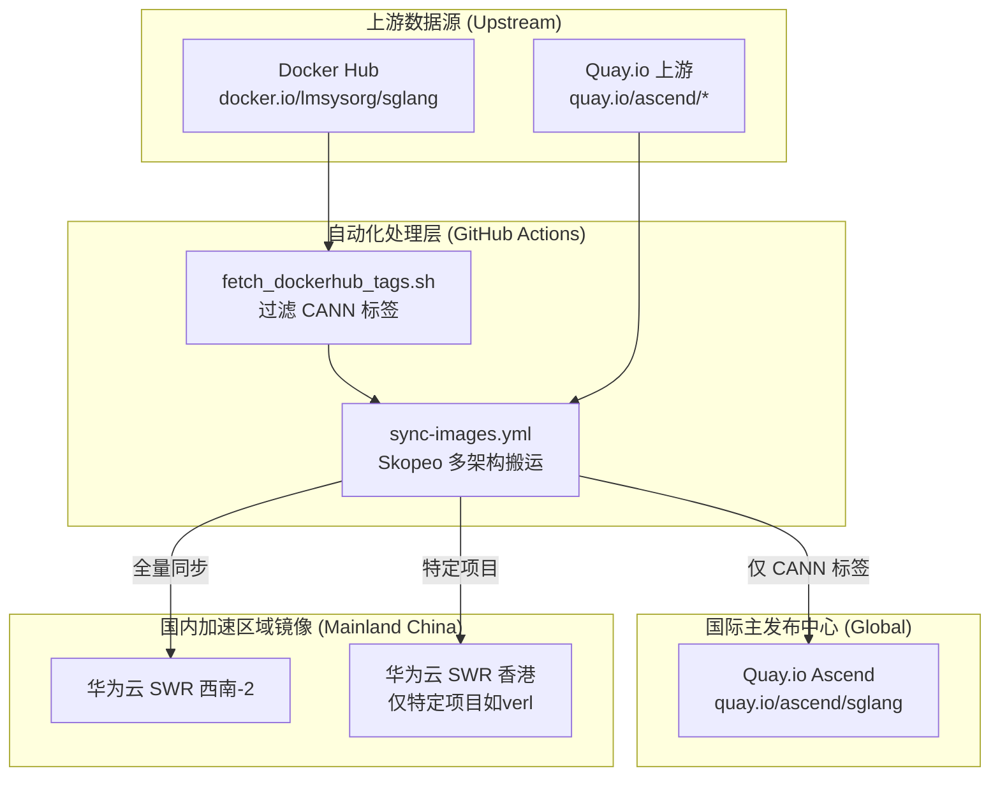

# 镜像地址指引与同步数据流

本文档详细列出所有可用的容器镜像发布地址，并说明镜像、模型与数据集的自动化同步数据流与技术细节。

## 1. 总体发布地址汇总

为了满足不同地区用户的极速拉取需求，本项目采用了“全球发布 + 区域镜像”的策略，主要提供以下几类基础发布 registry：

| 节点类型 | Registry 地址 | 适用场景 |
| :--- | :--- | :--- |
| **国际主节点 (Global)** | `quay.io/ascend` | 推荐海外用户或公网 CI/CD 环境使用 |
| **国内加速西南节点** | `swr.cn-southwest-2.myhuaweicloud.com/base_image/ascend-ci` (基础同步)   `.../dockerhub/<org>` (DockerHub开源同步)   `.../modelfoundry/ascend-ci` (专项存储) | 推荐国内研发用户使用，提供极速下载体验 |
| **国内加速香港节点** | `swr.ap-southeast-1.myhuaweicloud.com/base_image/ascend-ci` | 特定项目（如 verl）的区域分发 |

---

## 2. 各项目详细镜像地址指引

### 2.1 SGLANG 发行镜像 (从 Docker Hub 同步)

SGLANG 的官方镜像发布于 Docker Hub。本项目自动将其中 **包含 CANN 关键字** 的标签同步到以下仓库，供用户选择：

| 地址 | 说明 | 标签范围 |
|------|------|----------|
| `docker.io/lmsysorg/sglang:[tag]` | Docker Hub 官方源 | 所有官方标签 |
| `swr.cn-southwest-2.myhuaweicloud.com/base_image/dockerhub/lmsysorg/sglang:[tag]` | 华为云 SWR 西南2 | 仅 **CANN 标签** |
| `quay.io/ascend/sglang:[tag]` | Quay.io 组织仓库 | 仅 **CANN 标签** |

### 2.2 基础环境与工具镜像 (从 Quay.io 上游同步)

包括 CANN、PyTorch、vLLM-ascend、LlamaFactory、Triton 等基础环境。

**Quay.io (上游主节点):**
- `quay.io/ascend/cann:[tag]`
- `quay.io/ascend/vllm-ascend:[tag]`
- `quay.io/ascend/manylinux:[tag]`
- `quay.io/ascend/llamafactory:[tag]`
- `quay.io/ascend/triton:[tag]`
- `quay.io/ascend/mindspore:[tag]`
- `quay.io/ascend/python:[tag]`
- `quay.io/ascend/pytorch:[tag]`

**华为云 SWR 西南2 (国内加速):**
- 对应替换前缀为：`swr.cn-southwest-2.myhuaweicloud.com/base_image/ascend-ci/[repo]:[tag]`

### 2.3 VERL 专项镜像

VERL（Vision‑Enhanced Reinforcement Learning）是视觉强化学习的专用镜像：
- **Quay.io**: `quay.io/ascend/verl:[tag]`
- **SWR 香港**: `swr.ap-southeast-1.myhuaweicloud.com/base_image/ascend-ci/verl/verl:[tag]`

---

## 3. 同步数据流架构 (Data Flow)

为了确保镜像的高可用性和区域访问加速，本项目实施了自动化的镜像与数据同步机制。

### 3.1 镜像同步数据流向图

### 3.2 自动化同步技术细节

- **同步频率与触发**: 
  - **镜像**: 统一由 GitHub Actions 每小时自动触发 (`0 * * * *`)，或者通过界面手动 `workflow_dispatch` 触发。
  - **模型与数据集**: 针对 VLLM、SGLANG 等，每 6 小时自动触发 (`0 */6 * * *`) 下载至 Runner 的本地缓存路径（如 `/root/.cache/models`）。
- **执行环境与工具**:
  - **镜像同步**: 在 `ubuntu-latest` 上使用 `quay.io/skopeo/stable:latest` 容器执行，`skopeo` 会流式传输多架构 (Multi-arch) 镜像，避免将大型镜像写盘。
  - **模型同步**: 使用 `python:3.11-slim` 环境，在专门配置好的持久化物理机器 Runner 上运行，利用 `modelscope` 或 `huggingface_hub` 拉取数据。
- **故障容错与防静默失败 (Fail-Safe)**:
  - Skopeo 配置了网络异常重试参数 (`--retry-times 3` / `--retry-delay 5s`)。
  - 工作流遵循本项目 **单一真实来源 (SSOT)** 与 **容错原则**，采用了 `FAIL_COUNT` 累计错误机制：当遍历多个镜像或模型时，单一项的下载失败不会直接终止循环，而是被记录累加，循环结束后再判断 `exit 1`。保证所有可用任务都能执行完毕，且不遗漏错误报警。

---

## 4. 常见问题 (FAQ)

**Q: 如果某个标签在目标仓库找不到怎么办？**  
A: 可能是该小时的同步尚未完成，请稍等整点之后检查，或者在 Actions 中手动触发同步。若是 Docker Hub 开源项目的标签，请确认原标签名是否包含 `cann` 关键字。

**Q: 如何查找云端到底有哪些可用 tag？**  
A: 
- Docker Hub: `curl -s "https://hub.docker.com/v2/repositories/lmsysorg/sglang/tags/" | jq '.results[].name'`
- Quay.io: 浏览器访问 `https://quay.io/repository/ascend/<repo>?tab=tags`

**Q: 如何请求同步新的镜像或模型？**  
A: 
- 增加镜像：修改 `.github/workflows/sync-images.yml`。
- 增加模型/数据集：编辑 `.github/workflows/config/` 下对应的 `.ini` 或 `.json` 配置文件，提交 PR 即可触发更新。
