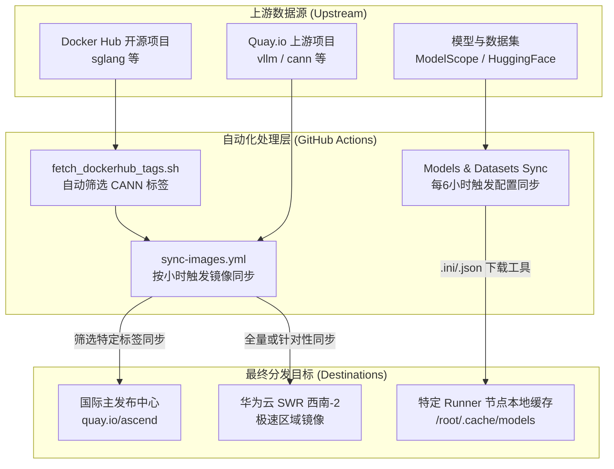

# 同步工具 (sync-tools) 说明

## 项目概述

本项目通过[skopeo](https://github.com/containers/skopeo)等工具将各种昇腾 (Ascend) 可用的容器镜像、模型和数据集从主要的上游数据源（如 Docker Hub、Quay.io、HuggingFace、ModelScope）同步到各种高可用发布 Registry 和物理节点缓存中，方便用户就近获得极速下载体验。

## 1. 总体发布地址 (Overall Release Registries)

为了满足不同地区用户的拉取需求，本项目采用 **"全球发布 + 区域镜像"** 的策略。目前包含以下几大核心发布地址：

| 节点类型 | Registry 地址前缀 | 适用场景 |
| :--- | :--- | :--- |
| **国际主发布中心 (Global)** | `quay.io/ascend` | 推荐海外用户或公网 CI/CD 环境使用 |
| **国内西南加速节点 (SWR SW-2)** | `swr.cn-southwest-2.myhuaweicloud.com/base_image/ascend-ci` <br> *(含 `/dockerhub` 及 `/modelfoundry`)* | 推荐国内研发用户使用，提供极速下载体验 |
| **国内香港加速节点 (SWR HK)** | `swr.ap-southeast-1.myhuaweicloud.com/base_image/ascend-ci` | 特定项目扩展的区域分发（如 verl） |

> **提示**：关于每个具体项目（如 SGLANG, vLLM, CANN, PyTorch）应使用哪个镜像地址及对应标签的详细说明，请参阅 📖 **[镜像地址指引与同步数据流](IMAGE_SYNC_GUIDE.md)**。

---

## 2. 同步数据流架构 (Sync Data Flow)

本项目完全基于 GitHub Actions 自动化构建，支持多架构 (Multi-arch) 镜像搬运，数据流向清晰且具备完备的防静默失败容错 (Fail-Safe) 机制。



### 数据流向说明:
1. **从 Docker Hub 同步开源项目**: 针对 SGLANG 等项目，自动提取包含 `cann` 关键字的相关标签，同步至 Quay.io (国际主节点) 和 华为云 SWR (国内加速节点)。
2. **基础镜像全量同步**: 将位于 `quay.io/ascend/*` 的基础环境镜像 (如 CANN、vLLM、Triton、LlamaFactory 等) 自动多架构全量同步至华为云 SWR 西南-2 和香港节点，为国内用户提供网络加速。
3. **模型与数据集缓存同步**: 读取配置文件 (`.ini`/`.json`)，利用 `modelscope` / `huggingface_hub` 将外部模型或数据集自动缓存在专门配置的物理机 Runner 本地，供后续持续集成任务使用。

更详细的技术同步机制（如 Skopeo 流传输、失败自动重试、FAIL_COUNT 异常兜底策略等），见 **[同步数据流详细架构文档](IMAGE_SYNC_GUIDE.md#3-同步数据流架构-data-flow)**。

---

## 3. 包含的重点镜像快速索引

| 镜像项目 | 源地址 (Upstream) | 目标国内加速地址 (SWR Southwest-2) |
|--|--|--|
| **[sglang](https://github.com/sgl-project/sglang)** | `docker.io/lmsysorg/sglang` | `swr.cn-southwest-2.myhuaweicloud.com/base_image/dockerhub/lmsysorg/sglang` |
| **[vllm-ascend](https://github.com/vllm-project/vllm-ascend)** | `quay.io/ascend/vllm-ascend` | `swr.cn-southwest-2.myhuaweicloud.com/base_image/ascend-ci/vllm-ascend/vllm-ascend` |
| **[verl](https://github.com/verl-project/verl)** | `docker.io/verlai/verl` <br> `quay.io/ascend/verl` | `swr.cn-southwest-2.myhuaweicloud.com/base_image/ascend-ci/verl/verl` |
| **[llamafactory](https://github.com/hiyouga/LlamaFactory)** | `quay.io/ascend/llamafactory` | `swr.cn-southwest-2.myhuaweicloud.com/base_image/ascend-ci/llamafactory/llamafactory` |
| **[veomni](https://github.com/ByteDance-Seed/VeOmni)** | `quay.io/ascend/veomni` | `swr.cn-southwest-2.myhuaweicloud.com/base_image/ascend-ci/veomni/veomni` |
| **[cann](https://gitcode.com/cann)** | `quay.io/ascend/cann` | `swr.cn-southwest-2.myhuaweicloud.com/base_image/ascend-ci/cann/cann` |
| **[triton-ascend](https://gitcode.com/ascend/triton-ascend)** | `quay.io/ascend/triton` | `swr.cn-southwest-2.myhuaweicloud.com/base_image/ascend-ci/triton/triton` |
| *(注：更多规划中镜像见 [Actions 同步日志](https://github.com/ascend/sync-tools/actions))* |

---

## 4. 项目结构与配置文件

本项目核心由 `.github/workflows` 控制，可通过向配置文件添加记录实现自动同步。

```
.github/
└── workflows/
    ├── config/                           # 模型/数据集同步配置文件目录
    │   ├── vllm-downloaded-models.ini    # VLLM 模型同步配置
    │   ├── vllm-downloaded-datasets.ini  # VLLM 数据集同步配置
    │   ├── sglang-downloaded-models.ini  # SGLANG 模型同步配置
    │   ├── hk001-models.json             # HK001 多平台模型同步配置 (JSON)
    │   └── hk001-datasets.json           # HK001 多平台数据集同步配置 (JSON)
    ├── sync-images.yml                   # 核心镜像同步工作流 (Skopeo)
    ├── reusable-sync-models-datasets.yml # 抽取复用的模型/数据集下载核心逻辑
    ├── vllm-sync-models-datasets.yml     # VLLM 同步入口
    ├── sglang-opensourse-sync-models-datasets.yml   # SGLANG 开源同步
    └── hk001-sync-models.yml             # HK001 模型同步入口
```

## 5. 使用与排查方法

### 5.1 修改同步镜像列表
如需增加自动搬运的基础镜像，请修改 [`sync-images.yml`](.github/workflows/sync-images.yml)。

### 5.2 修改同步模型列表
编辑对应的 `.ini` 或 `.json` 配置文件：

```ini
# INI 示例配置 (针对单一平台如 ModelScope)
model_name_1
```

```json
// JSON 示例配置 (支持多平台: ModelScope 或 HuggingFace)
[
  {
    "platform": "modelscope",
    "organization": "organization_name",
    "model_name": "model_name"
  }
]
```

### 5.3 故障排查建议
- **镜像同步超时**: 可适当在 Action 参数中调整 `skopeo` 的重试次数和间隔。
- **配置未生效**: 确保 `.ini` 或 `.json` 格式合法且无多余换行符；请检查 Runner 节点网络连通性。

---
*更多细节请参考 [镜像地址指引与同步数据流](IMAGE_SYNC_GUIDE.md)。*
